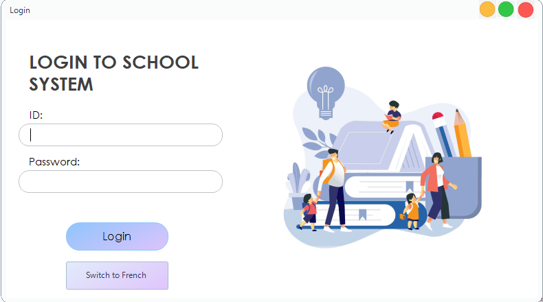
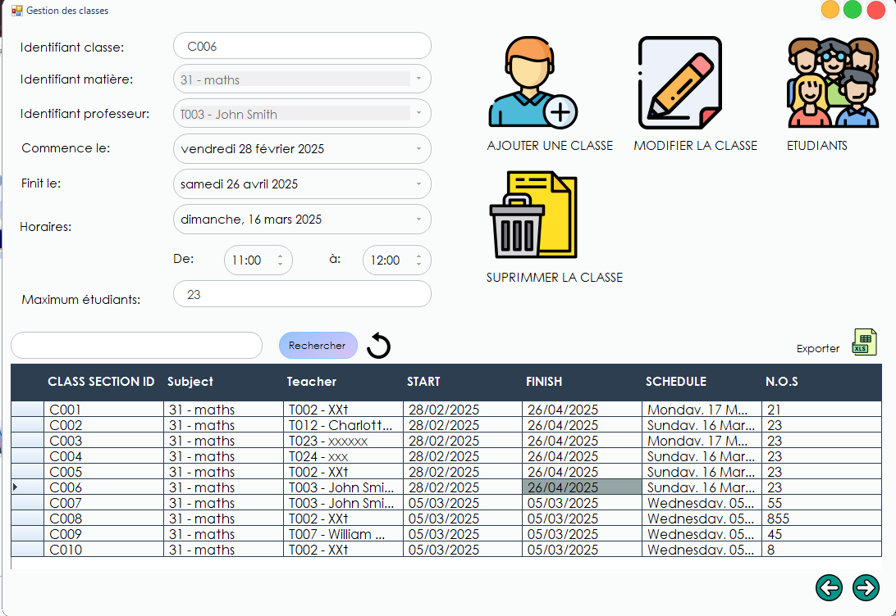

# Guide d'Installation et d'Utilisation

## Ouvrir le Projet
1. Lancez **Visual Studio 2022**.
2. Ouvrez le fichier `.sln` situé dans le répertoire du projet.

## Configurer la Base de Données
1. Créez une nouvelle base de données dans **MariaDB/MySQL** (par exemple, `gestion_etudiants_db`).
2. Mettez à jour la chaîne de connexion dans le fichier de configuration du projet (par exemple, `appsettings.json`) avec vos identifiants de base de données :

```json
"ConnectionStrings": {
  "DefaultConnection": "Server=localhost;Database=gestion_etudiants_db;User=root;Password=votre_mot_de_passe;"
}
```

//Sinon exécutez les scripts SQL fournis pour configurer les tables et les données initiales.

## Compiler et Lancer
1. Compilez la solution dans **Visual Studio** (`Ctrl+Shift+B`).
2. Exécutez l’application (`F5`).

## Utilisation
### Cas 1 : L’Administrateur Crée un Compte Étudiant
1. Connectez-vous en tant qu’administrateur.
2. Accédez à la section **"Gestion des Étudiants"**.
3. Cliquez sur **"Ajouter un Étudiant"**.
4. Remplissez les champs requis (ex : Nom, Prénom, ID Étudiant, Classe).
5. Validez pour créer le compte.

### Cas 2 : L’Enseignant Gère les Notes
1. Connectez-vous en tant qu’enseignant.
2. Rendez-vous dans la section **"Gestion des Classes"**.
3. Sélectionnez une classe (ex : 1ère Année).
4. Choisissez un étudiant et saisissez sa note pour une évaluation ou un examen.
5. Enregistrez les modifications.

## Captures d’Écran
Voici quelques écrans clés de l’application :
- **Écran de Connexion**
- **Tableau de Bord Administrateur**
- **Vue des Classes Enseignant**
- **Vue des Notes Étudiant**


## Structure du Projet
```
/src        -> Contient le code source en C#
/database   -> Scripts SQL pour la configuration de la base de données
/docs       -> Documentation du projet (ex : fichiers Word/Excel)
/screenshots -> Dossier pour les captures d’écran de l’application
```

## Sécurité & Conformité
- **Contrôle d’Accès** : Authentification basée sur les rôles pour les administrateurs, enseignants et étudiants.
- **Sauvegarde des Données** : Sauvegardes automatisées régulières pour éviter toute perte de données.
- **Conformité RGPD** : Garantit la protection des données personnelles conformément aux réglementations européennes.

## Améliorations Futures
- Ajouter la prise en charge de plusieurs langues.
- Développer une version web pour une accessibilité accrue.
- Intégrer des notifications par email pour les mises à jour des notes et des emplois du temps.

## Contact
Pour toute question ou assistance, contactez :

**Samia Boutezrout**
- **Email** : samaholiccs@gmail.com
- **Établissement** : Webitech, 6-8 Rue Firmin Gillot, 75015 Paris
  




**Dernière mise à jour : 21 mars 2025**
